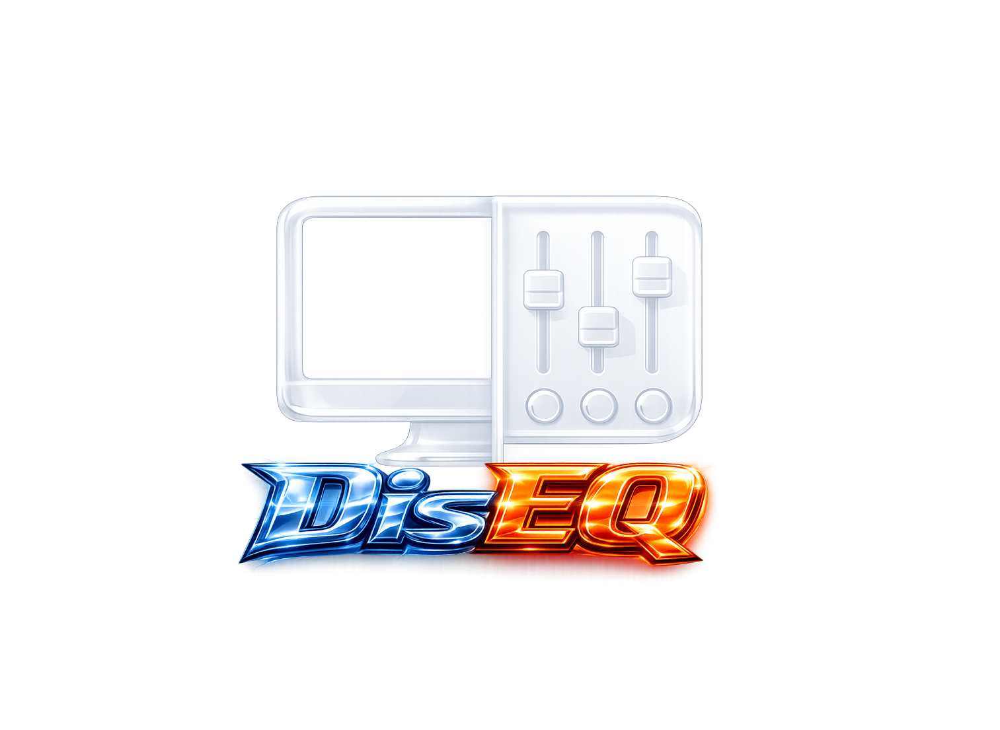

<div align="center">
  
  <p>
    A lightweight macOS menu-bar utility for controlling displays and system
    audio from one native AppKit panel.
  </p>
</div>

## Features

### Displays

| Feature | What it does |
|---|---|
| Brightness | Per-display, using whichever backend the display supports: the built-in panel frameworks, DDC/CI over I2C for external monitors, or a gamma ramp as a fallback. The card labels which one is in use. Auto Brightness toggles alongside it. |
| Resolution and refresh rate | Lists the modes macOS actually publishes, and toggles HiDPI where the display offers it. The readout previews continuously while dragging and reconfigures WindowServer once, on release. |
| Connect / disconnect | Takes a display out of the layout and darkens it, via hard disconnect where available and a mirror fallback where it is not. |
| Main display | Marks the main display, sorts it first, and reassigns it. |
| Layout and mirroring | Moves a display's position, mirrors it to another, and pins a layout with Configuration Protection so macOS cannot shuffle it back. |
| Night Shift | Exposed on the main display only, because macOS tracks it system-wide rather than per monitor. |
| Colour | Warm/cool/neutral adjustment and per-display colour mode. |
| Device control | Vendor, model, serial, display ID, DDC match confidence, the resolved brightness backend, and read-only notch and brightness-upscaling indicators — for working out why a display behaves the way it does. |

### Sound

| Feature | What it does |
|---|---|
| Ten-band equaliser | ISO centres from 32 Hz to 16 kHz, ±24 dB per band, 0.5-octave bandwidth. |
| 23 presets | eqMac's preset table, cross-faded over 500 ms so switching never clicks. |
| Preamp | Manual, or Auto Preamp to pull back the headroom a boosted band needs. Capped at +5 dB, since the preamp lifts all ten bands at once. |
| Output routing | Routes system audio through the equaliser to any hardware output, following the device you pick in Sound settings. |
| Volume | Drives the hardware's own volume where it has one, mirrored onto the virtual device so the menu-bar slider and the volume keys keep working. |
| App Mixer | Per-application volume faders for whatever is currently playing. |

### General

| Feature | What it does |
|---|---|
| No capture permission | The equaliser needs neither Microphone nor System Audio Recording. See [Permissions](#permissions). |
| Persistent settings | Every EQ, routing and card-disclosure setting is restored on relaunch, from `~/Library/Application Support/DisEQ/settings.json`. |
| Launch at Login | Via the public `SMAppService` API, with a shortcut to Login Items when macOS wants approval. |
| Native and small | Rust directly against AppKit — roughly 14–16 MB idle and 0.0% idle CPU. See [PERFORMANCE.md](PERFORMANCE.md). |

## Permissions

The equaliser requires **no** capture permission. The HAL plug-in *is* the
output device, so `coreaudiod` hands it every frame the machine plays without
any grant being involved; the frames reach the app through POSIX shared
memory, which `coreaudiod`'s sandbox profile allows outright. Reading a
device's input stream would be microphone access and a process tap would be
audio capture — the equaliser's signal path uses neither.

The App Mixer is the one exception. Per-application faders are built on process
taps, so switching it on prompts for **System Audio Recording**. Everything
else, including the equaliser, works without it.

## Requirements

- macOS 14 or newer on Apple Silicon
- Rust 1.85 or newer
- Xcode command-line tools

## Build and run

DisEQ must run from an application bundle for its menu-bar status item to work:

```sh
make app-release
open target/DisEQ.app
```

For a debug build and restart during development:

```sh
make run
```

Run the verification suite with:

```sh
make check
make test
make lint
```

## Audio driver

Audio enhancement requires the companion HAL plug-in. Building it does not
need administrator privileges:

```sh
make driver
```

Installing it writes to `/Library/Audio/Plug-Ins/HAL` and restarts
`coreaudiod`, briefly interrupting all audio:

```sh
make driver-install
```

Use `make driver-uninstall` to remove it. Display controls work without the
audio driver.

## Implementation notes

The app is written in Rust directly against AppKit through `objc2`. Some
display capabilities and the native Night Shift toggle require dynamically
loaded private macOS interfaces. Missing interfaces disable only the affected
feature rather than preventing the app from launching.

See [technical_docs.md](technical_docs.md) for the system-interface reference
and [PERFORMANCE.md](PERFORMANCE.md) for the measured release footprint and
optimization roadmap.

## Attribution and licensing

Portions of the audio engine are derived from eqMac under Apache License 2.0.
The exact provenance and modifications are listed in
[ATTRIBUTION.md](ATTRIBUTION.md); the applicable license text is included at
[LICENSES/Apache-2.0.txt](LICENSES/Apache-2.0.txt).

No license is granted for the remainder of the repository unless one is added
explicitly.
